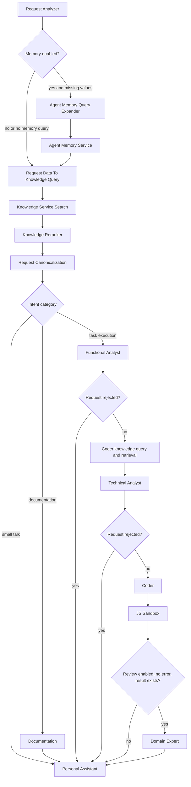

# AMCodePipeline

An ASP.NET Core plugin that runs a code-oriented AI request pipeline on [AgentMesh](https://github.com/demetrio-marra/AgentMeshCodeMode).

AgentMesh supplies the runtime, HTTP API, authentication, Swagger UI, component discovery, and workflow primitives. This project is the deployable plugin: it defines the code pipeline, its agents, prompts, configuration, and external-service bindings.

## What It Does

`AMCodePipeline` accepts authenticated chat requests and uses a staged workflow to classify the request, retrieve relevant context, and produce a final response. The request can follow one of these paths:

- **Small talk**: responds through the personal-assistant agent.
- **Documentation**: retrieves and reranks knowledge, then produces documentation-oriented output.
- **Task execution**: analyzes the request, gathers coding knowledge, creates code, optionally executes it in the JavaScript sandbox, and can submit successful results to the domain-expert agent.

The plugin also includes a summarization pipeline that condenses conversations and evaluates facts suitable for agent memory.

## Architecture



The empty `DefaultPipelinePlugin` marker lets AgentMesh Runtime discover the concrete pipeline, step, agent, parameter, and serializer implementations in this assembly. `Program.cs` is the composition root: it loads configuration, binds `CodePipeline`, then starts AgentMesh Runtime.

For the detailed agent, step, parameter, configuration, and pipeline-flow reference, see [the architecture guide](docs/architecture.md).

## Prerequisites

- .NET 8 SDK
- Access credentials for at least one configured inference provider
- Optional: LightRAG, Mem0, Cohere-compatible reranking, and the JavaScript sandbox services, when their workflow features are enabled

## Configuration

The application loads, in order:

1. `appsettings.json` (required)
2. `appsettings.{Environment}.json` (optional)
3. Environment variables

Do not commit real credentials. Configure secrets through environment variables for deployed environments. At a minimum, replace placeholder API keys in the relevant `InferenceProviders` entry and configure `ApiAuth:ApiKey`.

Key configuration sections:

| Section | Purpose |
| --- | --- |
| `ApiAuth` | Protects the AgentMesh HTTP API with the configured header and API key. |
| `InferenceProviders` | OpenAI-compatible provider endpoints and API keys. |
| `LLMs` | Named model definitions, including provider and token-cost metadata. |
| `Agents` | Per-agent model selection, temperature, and system-prompt file. |
| `CodePipeline` | Enables memory and domain-expert stages and sets the knowledge-base language. |
| `AgentMemoryService`, `LightRagService`, `CohereV1RerankerService`, `SESJSSandbox` | External service connections used by optional workflow stages. |

Prompt files are kept in `AMCodePipeline/Prompts` and copied to the application output directory during build. Reference them from the corresponding `Agents` setting.

## Run Locally

From the repository root:

```bash
dotnet restore AMCodePipeline/AMCodePipeline.csproj
dotnet run --project AMCodePipeline/AMCodePipeline.csproj
```

The Development launch profile listens on `http://localhost:5043` and opens Swagger at `http://localhost:5043/swagger`.

Provide an API key with the header configured by `ApiAuth:HeaderName` (default: `X-Api-Key`) when calling protected endpoints.

## Run with Docker

Build the image from this repository root:

```bash
docker build -t am-code-pipeline .
docker run --rm -p 8080:8080 \
	-e ApiAuth__ApiKey=your-api-key \
	-e InferenceProviders__OpenAI__ApiKey=your-provider-key \
	am-code-pipeline
```

Supply production values for the selected inference provider and any external services through environment variables or an environment-specific configuration file. The image exposes port `8080`.

## Project Layout

| Path | Responsibility |
| --- | --- |
| `AMCodePipeline/Program.cs` | Plugin host setup and AgentMesh Runtime startup. |
| `AMCodePipeline/DefaultPipelinePlugin.cs` | AgentMesh plugin-discovery marker. |
| `AMCodePipeline/Services/Pipelines` | Chat and conversation-summarization workflow orchestration. |
| `AMCodePipeline/Services/EWSteps` | Agentic and code-driven workflow steps. |
| `AMCodePipeline/Models` | Request-analysis, analyst, parameter, and workflow data models. |
| `AMCodePipeline/Prompts` | System prompts used by the configured agents. |
| `AMCodePipeline/appsettings.json` | Active local configuration template. |

## Related Project

For the reusable framework, runtime contracts, and plugin architecture, see [AgentMesh](https://github.com/demetrio-marra/AgentMeshCodeMode).
