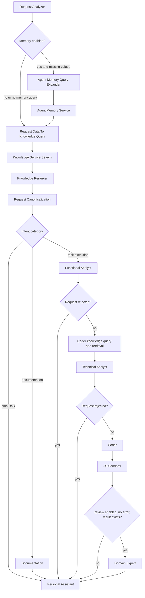
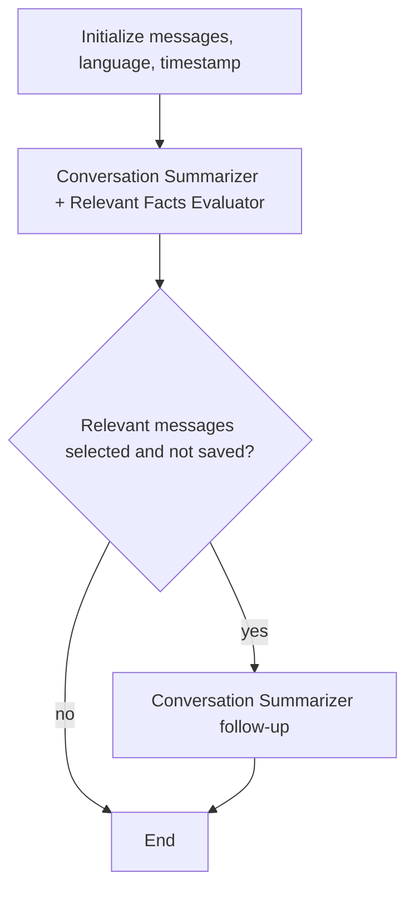

# AMCodePipeline Architecture

AMCodePipeline is a deployable ASP.NET Core plugin for [AgentMesh](https://github.com/demetrio-marra/AgentMeshCodeMode). It owns the code-oriented agents, workflow steps, typed parameters, prompts, configuration, and pipeline decisions. AgentMesh owns the reusable runtime, HTTP surface, execution engine, service contracts, and workflow primitives.

## Runtime Boundary

The application starts in `Program.cs`:

1. ASP.NET Core creates the builder and replaces the default configuration sources.
2. Configuration is loaded from the required `appsettings.json`, an optional environment-specific JSON file, and environment variables.
3. The `CodePipeline` section is bound to `CodePipelineConfiguration` and registered as a singleton.
4. `AgentMeshRuntime.LoadAgentMesh<DefaultPipelinePlugin>(builder)` loads the plugin assembly and lets AgentMesh discover its pipelines, steps, agents, parameters, serializers, and related registrations.
5. The application builds the host and calls `AgentMeshRuntime.StartAgentMesh(app)` to expose and run the AgentMesh Runtime HTTP service.

`DefaultPipelinePlugin` is intentionally empty. Its `IAgentMeshPlugin` implementation is the marker that identifies this assembly as a plugin; it is not itself a pipeline or a service registry. The reusable framework boundary is defined by AgentMesh interfaces such as `IEWPipeline`, `IEWStep`, `IEWAgenticStep`, `IParameterStore`, and `IWorkflowProgressNotifier`.

## Execution Model

An `IEWPipeline` repeatedly asks its implementation for the next set of `IEWStep` instances. Each step declares typed input and output parameter types and returns output mutations. AgentMesh's `EWPipeline` base class performs the common execution work:

1. Notify workflow start.
2. Snapshot each step's declared input parameters.
3. Notify step start with serialized display values.
4. Execute all steps in the current batch. Multiple returned steps may run concurrently.
5. Commit output mutations through `IParameterStore`, using the output versions captured before execution.
6. Record before/after values and, for agentic steps, agent name and token statistics.
7. Notify step completion and ask the pipeline for the next batch.
8. Notify workflow end when no steps remain.

Agentic steps implement `IEWAgenticStep`, which extends `IEWStep` with an agent name and token-accounting flags. Their agents derive from AgentMesh's `AbstractAgent<T>`: input parameters are serialized into model messages, responses are parsed into a typed result, and empty or invalid structured responses use the framework retry policy. Code-driven steps implement `IEWStep` directly and call deterministic services or transform state.

The parameter store is the shared data plane. A step should communicate with later steps by declaring a parameter input or output, not by reaching into another step's local state. Parameter configurations also provide display names and serializers for workflow progress output.

## Configuration and Prompts

Configuration ownership is split between the AgentMesh Runtime and this plugin:

| Section | Owner | Purpose |
| --- | --- | --- |
| `ApiAuth` | AgentMesh Runtime | Protects the HTTP API. |
| `InferenceProviders` | AgentMesh infrastructure | Names OpenAI-compatible endpoints and credentials. |
| `LLMs` | AgentMesh/host configuration | Maps logical model names to providers, models, and cost metadata. |
| `Agents` | AMCodePipeline | Selects an LLM, temperature, and system prompt for each agent. |
| `CodePipeline` | AMCodePipeline | Enables memory and domain-expert stages and sets the knowledge-base language. |
| `AgentMemoryService` | AgentMesh connector | Configures Mem0-compatible memory access. |
| `LightRagService` | AgentMesh connector | Configures knowledge retrieval. |
| `CohereV1RerankerService` | AgentMesh connector | Configures reranking. |
| `SESJSSandbox` | AgentMesh connector | Configures JavaScript execution. |

Agent entries refer to prompt files under `Prompts/`. The project file copies those files to the application output directory. Prompt text is part of the agent behavior, while model/provider selection remains configuration. Credentials must be supplied through deployment configuration or environment variables and are intentionally absent from this guide.

## Agents and Agentic Steps

Every row maps an AMCodePipeline agent to the step that invokes it. Inputs and outputs are parameter categories rather than a full DTO listing.

| Agent / step | Responsibility | Inputs -> outputs | Pipeline use |
| --- | --- | --- | --- |
| `RequestAnalyzer` / Request Analyzer | Classifies the request and extracts intent, language, preferences, entities, missing values, and small-talk state. | Request and conversation context -> request-analysis parameters | First step of `ChatRequestPipeline`. |
| `AgentMemoryQueryExpander` / Agent Memory Query Expander | Expands missing-value or context-driven memory queries. | Missing values and request context -> memory query results | Optional memory pre-processing in chat. |
| `KnowledgeReranker` / Knowledge Reranker | Reranks retrieved knowledge documents and preserves selected entities and relations. | Knowledge query result and query context -> reranked knowledge result | Shared knowledge phase in chat. |
| `CanonicalizerAgent` / `RequestCanonicalization` / Request Canonicalization | Converts the analyzed request and retrieved context into a canonical request representation. | User request, analysis, and knowledge context -> canonical request parameters | Final shared phase before branch selection. |
| `PersonalAssistant` / Personal Assistant | Produces the final response for small talk, documentation completion, rejected work, or general completion. | Request context and accumulated pipeline data -> `PipelineResultData`/final response data | Terminal step in all chat branches. |
| `Documentation` / Documentation | Produces documentation-oriented output from the request and retrieved knowledge. | Canonical request and knowledge result -> `PipelineResultData` | Documentation branch. |
| `FunctionalAnalyst` / Functional Analyst | Evaluates task feasibility and derives business requirements. | Canonical request, user data, knowledge, and preferences -> requirements and rejection state | First task-execution step. |
| `KnowledgeQueryBuilderForCoder` / Knowledge Query Builder For Coder | Builds a coding-specific knowledge query. | Canonical task and requirements -> coder knowledge query | Task branch when the request is not rejected. |
| `KnowledgeForCoderReranker` / Knowledge For Coder Reranker | Selects the most relevant coding knowledge for the coder. | Coder query and retrieved results -> coder knowledge content | Task branch when the request is not rejected. |
| `TechnicalAnalyst` / Technical Analyst | Converts requirements and coding knowledge into a technical specification. | Requirements, request context, and coder knowledge -> technical specification | Task branch when the request is not rejected. |
| `Coder` / Coder | Generates JavaScript code for the technical specification. | Technical specification and coder knowledge -> generated code | Task branch when the request is not rejected. |
| `DomainExpert` / Domain Expert | Reviews successful execution output against domain knowledge. | Requirements, knowledge, execution result, and pipeline result -> enriched pipeline result | Optional final task review. |
| `ConversationSummarizer` / Conversation Summarizer | Condenses conversation messages. | Messages and requested language -> summarized content and timestamp | `SummarizationPipeline`. |
| `RelevantFactsEvaluator` / Relevant Facts Evaluator | Selects conversation content worth persisting as agent memory. | Summary and conversation context -> relevant messages | `SummarizationPipeline`; its result can feed memory persistence. |

## Code-Driven Steps and Service Boundaries

| Step | Contract | Boundary or deterministic role |
| --- | --- | --- |
| Agent Memory Service | Memory query parameters -> `PastMemoriesQueryResults` | Calls the AgentMesh agent-memory executor when memory is enabled. |
| `AgentMemorySaverServiceEWCodeStep` / Agent Memory Saver Service | Relevant messages -> no output parameter | Persists selected messages through the agent-memory executor. |
| `RequestDataToKnowledgeQueryEWCodeStep` / Request Data To Knowledge Query | Request-analysis and language parameters -> `KnowledgeQuery` | Converts local request data to the AgentMesh knowledge-query model. |
| Knowledge Service Search | `KnowledgeQuery` -> `KnowledgeQueryResult` | Calls `IKnowledgeService`, backed by the configured LightRAG connector. |
| Knowledge For Coder Service Search | Coder knowledge query -> coder query result | Calls `IKnowledgeService` for task-specific retrieval. |
| JS Sandbox | Generated code -> execution id, result type, and output/error data | Calls the configured JavaScript sandbox and maps success and sandbox failures into pipeline parameters. |
| Knowledge Reranker steps | Retrieved knowledge -> selected knowledge | Although they are agentic steps for telemetry and token accounting, their deterministic work calls `IRerankerService` to select documents. |

## Chat Request Pipeline

`ChatRequestPipeline` initializes the last request, initial chat history, request timestamp, and knowledge-base language. It then uses `RunOnce` to prevent a step from running more than once and to apply data-dependent gates.

The branch gates are:

| Stage | Condition |
| --- | --- |
| Memory query expansion | `CodePipeline.EnableMemoryService` is true and the missing-values parameter contains values. |
| Memory retrieval | Memory is enabled and the expanded past-memory query contains values. |
| Small talk | `IsSmallTalk` is true; the personal assistant handles the branch. |
| Documentation | Intent category is `Documentation`; documentation output is followed by the personal assistant. |
| Task execution | Intent category is `TaskExecution`; the task stages run in order. |
| Coder knowledge, technical analysis | The functional analyst has not rejected the request. |
| Coder and later task stages | The technical analyst has not rejected the request. |
| Domain expert | Domain review is enabled, the request is not rejected, execution did not report an error, and pipeline result data exists. |
| Final response | The personal assistant runs after the selected branch, including rejected task requests and paths that skip optional stages. |

The shared retrieval phase always converts request data to a knowledge query, queries knowledge, reranks the result, and canonicalizes the request before selecting a branch. The exact implementation is step-driven: each call to `GetNextStepsToRun` returns the next eligible step batch, and `RunOnce` tracks completed step names.

## Summarization Pipeline

`SummarizationPipeline` initializes the summarization language, messages to summarize, and request timestamp. On its first scheduling pass it returns both `ConversationSummarizer` and `RelevantFactsEvaluator` together. AgentMesh may execute a returned batch concurrently; both steps receive the state available at that point.

After that first pass, the pipeline checks whether relevant messages were selected and whether memory persistence has already been handled. It can schedule the summarizer step again for the persistence-related follow-up, then stops. The pipeline exposes summarized content and its timestamp as its result surface.

The summarization pipeline is separate from the chat request branch selection. Its fact-evaluation output is the typed input expected by the agent-memory saver step when memory persistence is wired into the surrounding runtime.

## Extension Guide

Add a new pipeline when the workflow has a distinct lifecycle and state contract. Derive it from AgentMesh's pipeline abstraction, expose an AgentMesh pipeline interface where appropriate, and use typed parameter configurations for shared state. Add a new step when existing orchestration can own the lifecycle but needs a new state transformation, service call, or agent invocation.

For a new agent, add the agent implementation, its corresponding agentic step, the system prompt, the `Agents` configuration entry, and any required registrations or parameter configurations. Keep framework-owned concerns in [AgentMesh](https://github.com/demetrio-marra/AgentMeshCodeMode); keep pipeline-specific decisions and models in this project. Update this document whenever a pipeline, agent, step, parameter contract, connector, or feature flag changes.